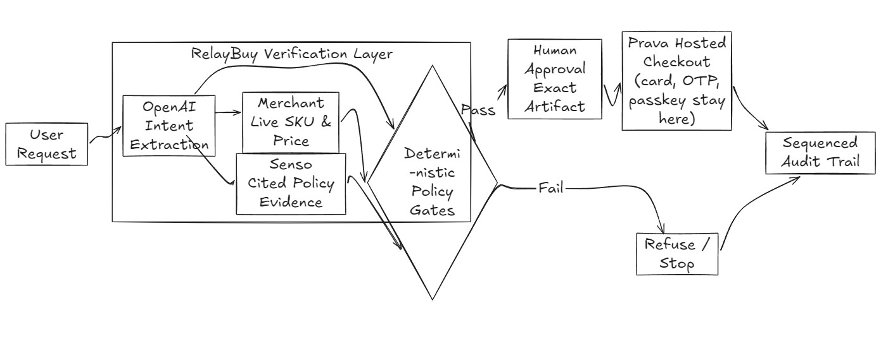

# RelayBuy

### Proof before purchase for AI agents

**The model extracts. Code decides. Humans approve. Prava authorizes.**

RelayBuy is the control layer I want autonomous shopping agents to use before
they spend. It turns a conversational request into one exact, evidence-backed
purchase artifact, shows that artifact to a human, and allows payment only for
the approved merchant, SKU, quantity, and total.

[Devfolio submission](https://devfolio.co/projects/relaybuy-5600) ·
[Watch the demo](https://www.loom.com/share/86af3563f6884bae9c2748d33b542fbd) ·
[Try RelayBuy](https://relaybuy.onrender.com) ·
[Judge demo](docs/JUDGE-DEMO.md) · [Architecture](docs/ARCHITECTURE.md) ·
[Security](docs/SECURITY.md) · [Prava runbook](docs/PRAVA-SANDBOX-RUNBOOK.md) ·
[Honest limitations](docs/KNOWN-LIMITATIONS.md)

## The problem I want to solve

Shopping agents are getting better at finding products and completing forms,
but a plausible choice is not necessarily an authorized choice. A model can
select the wrong gift-card denomination, act on stale policy, accept a changed
total, or retry an ambiguous payment. Today, users must either trust the agent
too much or supervise every step themselves.

I am building RelayBuy so an agent can do the repetitive work while the user
keeps control of the decision that matters: **exactly what may be purchased and
for how much**.

## What RelayBuy does

1. OpenAI converts the request into typed purchase intent and asks for missing
   constraints.
2. The merchant independently supplies the current product, SKU, option, and
   total; the model cannot invent them.
3. Senso supplies a version-and-digest-bound authorization record.
4. Deterministic checks compare the request, merchant quote, policy, budget,
   and evidence freshness.
5. A human reviews one hash-bound, expiring approval artifact.
6. Only that exact approved payload can reach Prava authorization and terminal
   reconciliation.

The memorable demo begins with refusal: ask for the wrong `$25` denomination
when policy authorizes `$10`, and RelayBuy stops before any Prava session exists.
The corrected request produces an exact artifact that can move to human
approval. Provider failure, stale evidence, changed facts, and unknown payment
outcomes all fail closed.

## Product screens

<p align="center">
  
  
</p>

The first screen proves the safety boundary. The second shows the exact-match
path with independently verified merchant facts and policy evidence.

## Architecture

[](docs/ARCHITECTURE.md)

OpenAI has no payment tools. PostgreSQL stores redacted workflow state and
claims external operations before execution, so a timeout cannot silently
become a duplicate retry. See the [architecture document](docs/ARCHITECTURE.md)
for the capability, persistence, provider, and recovery boundaries.

## Who this is for, and why now

RelayBuy is aimed at people and teams that want assistants to purchase routine,
well-bounded items without giving a language model open-ended spending power.
It can become useful for employee purchasing, household replenishment, travel
booking, accessibility workflows, and any agentic checkout where policy and
human intent must survive the jump from conversation to payment.

The immediate product is deliberately narrow: one real merchant, one exact
allowlisted item, real provider boundaries, and a judge-verifiable refusal and
approval flow. That narrow path makes every claim inspectable instead of hiding
payment risk behind a broad shopping demo.

## What I want to build next

- Merchant adapters that normalize quotes across more stores without trusting
  model-generated product facts.
- Reusable personal and team policies for budgets, merchants, categories, and
  approval thresholds.
- A portable proof receipt that explains what the agent requested, what policy
  allowed, what the human approved, and what the payment provider observed.
- Recovery workflows for price changes, expired evidence, and ambiguous payment
  outcomes without blind retries.
- Production Prava execution only after its authoritative checkout contract and
  the complete hosted authorization lifecycle are verified.

## Verified behavior and honest boundary

RelayBuy currently verifies the connected request, live merchant discovery,
OpenAI extraction, Senso evidence, deterministic refusal, exact approval
artifact, capability security, durable workflow state, and fail-closed Prava
gateway locally. The public deployment keeps payment and merchant-attempt flags
disabled.

It does **not** claim a completed purchase, moved funds, or a merchant order.
Those claims require the human-controlled Prava test-card, OTP, and passkey
ceremony followed by terminal reconciliation. The
[known limitations](docs/KNOWN-LIMITATIONS.md) keeps that external boundary
explicit.

## Run locally

Requirements: Node.js 20.9+, npm, PostgreSQL, and configured provider keys.

```bash
npm ci
cp .env.example .env.local
npm run dev
```

Open <http://localhost:3000>. Missing or unavailable providers return an
explicit error; the connected path never falls back to fixtures.

## Validate

```bash
npm run format:check
npm run lint
npm run typecheck
npm test
npm run build
npm run test:e2e
npm run rehearse
npm run preflight
npm run test:e2e:connected-refusal
```

`npm run preflight` performs the connected, payment-disabled provider check.
The separate `npm run sandbox:check` gate requires a complete private checkout
profile and explicitly armed sandbox flags before one human-controlled payment
lifecycle. Neither command prints secret values.

## Technology

Next.js, React, TypeScript, PostgreSQL, OpenAI Agents SDK, Senso, Prava, Zod,
Vitest, Playwright, and Render.

RelayBuy was built for the 2026 Prava Agentic Commerce Hackathon. The
[build disclosure](DISCLOSURE.md) separates the pre-event starting point from
the event implementation.
